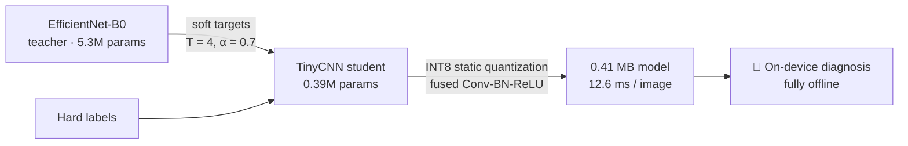

<div align="center">

# 🌿 KrishiScan

**Offline crop-disease detection that fits in 0.41 MB.**

A 0.39M-parameter CNN, distilled from an EfficientNet-B0 teacher and quantized to INT8 —
**99.40% test accuracy, 12.6 ms/image on CPU, zero internet required.**


</div>

---

Smallholder farmers lose a significant share of yield to crop diseases diagnosed too late. Yet most plant-disease classifiers are far too large for the low-end smartphones available in the field — and assume reliable internet connectivity that rural farms simply don't have.

**KrishiScan** takes a different route: compress a high-accuracy teacher into a sub-megabyte student that runs *entirely on-device*. No cloud, no connectivity, no waiting — point the camera at a leaf, get a diagnosis.

---

## 📊 Results

Measured on the held-out test split (10-class tomato subset of PlantVillage, stratified 80/10/10 splits):

| Model | Params | Size | Test accuracy |
|---|---:|---:|---:|
| Baseline (MobileNetV2) | 3.5M | 9.2 MB | 99.95% |
| Teacher (EfficientNet-B0) | 5.3M | 16.4 MB | 99.95% |
| Student (TinyCNN, fp32) | 0.39M | ~1.5 MB | 99.34% |
| **Student (INT8 quantized)** | **0.39M** | **0.41 MB** | **99.40%** |

> The INT8 student runs in **12.6 ms per image on a commodity CPU** — and quantization costs essentially nothing (99.34% → 99.40%, within run-to-run noise).

The headline: a model **~13× smaller** than the teacher gives up just **0.6 percentage points** of accuracy.

---

## 🔍 Explainability: Grad-CAM sanity check

A model that's right for the wrong reasons is useless in the field. We ran Grad-CAM on the student's final convolutional layer to verify its attention lands on disease lesions — not background or leaf edges.


*6/6 correct predictions, with heatmaps localizing on lesion zones across three different diseases. (Heat is somewhat diffuse on a couple of images — expected for a tiny student on clean lab imagery, and a discussion point for the full paper.)*

---

## 🧠 How it works



1. **Teacher training** — ImageNet-pretrained EfficientNet-B0 fine-tuned on the 10-class tomato subset (AdamW + cosine annealing) → 99.95% test accuracy.
2. **Knowledge distillation** — a compact 4-block TinyCNN (0.39M params) learns from the teacher's softened logits (temperature `T=4`, distillation weight `α=0.7`) combined with hard-label cross-entropy.
3. **INT8 static quantization** — Conv–BatchNorm–ReLU blocks are fused, then calibrated on validation batches to produce a true INT8 model (QuantStub/DeQuantStub at the boundaries). Result: 0.41 MB, 12.6 ms/image, accuracy unchanged.

### The student architecture

```python
class TinyCNN(nn.Module):
    def __init__(self, num_classes=10):
        super().__init__()
        self.features = nn.Sequential(
            nn.Conv2d(3, 32, 3, padding=1),   nn.BatchNorm2d(32),  nn.ReLU(), nn.MaxPool2d(2),
            nn.Conv2d(32, 64, 3, padding=1),  nn.BatchNorm2d(64),  nn.ReLU(), nn.MaxPool2d(2),
            nn.Conv2d(64, 128, 3, padding=1), nn.BatchNorm2d(128), nn.ReLU(), nn.MaxPool2d(2),
            nn.Conv2d(128, 256, 3, padding=1), nn.BatchNorm2d(256), nn.ReLU(),
            nn.AdaptiveAvgPool2d(1),
        )
        self.classifier = nn.Linear(256, num_classes)

    def forward(self, x):
        return self.classifier(self.features(x).flatten(1))
```

---

## 🚀 Quickstart

**Requirements:** Python 3.11+, PyTorch 2.x

```bash
git clone https://github.com/<your-username>/KrishiScan.git
cd KrishiScan
pip install torch torchvision
```

**Run inference with the quantized student:**

```python
import torch

model = TinyCNN(num_classes=10)  # see architecture above
# load the INT8-quantized weights and run on CPU — no GPU, no internet
state = torch.load("checkpoints/student_int8_pth.pth", map_location="cpu")
model.load_state_dict(state)
model.eval()
# x: a (1, 3, 224, 224) float tensor, ImageNet-normalized
with torch.no_grad():
    pred = model(x).argmax(1)
```

**Reproduce the pipeline** (each stage is a standalone notebook step):

| Stage | What it does |
|---|---|
| 1. Baseline | Fine-tune MobileNetV2, record test accuracy |
| 2. Teacher | Fine-tune EfficientNet-B0 → `teacher_best.pth` |
| 3. Distillation | Train TinyCNN student against teacher soft targets |
| 4. Quantization | Fuse + calibrate → INT8 model, measure size/latency/accuracy |
| 5. Grad-CAM | Hook final conv layer, overlay heatmaps, sanity-check attention |

Experiments were run on Kaggle (T4 GPU for training, CPU for latency measurement). Dataset: [PlantVillage](https://www.kaggle.com/datasets/abdallahalidev/plantvillage-dataset) (10-class tomato subset).

---

## 🗂️ Project structure

```
KrishiScan/
├── README.md
├── assets/
│   └── gradcam_sanity_check.png
├── notebooks/            # training, distillation, quantization, Grad-CAM
├── checkpoints/          # teacher_best.pth · student_best.pth · student_int8_pth.pth
└── src/                  # model definitions (TinyCNN), data loaders
```

---

## 🛣️ Roadmap

- [ ] Evaluate on in-the-wild field imagery (beyond lab-condition PlantVillage photos)
- [ ] Expand beyond tomato to more crops and disease classes
- [ ] Android app with fully offline TFLite inference
- [ ] Multilingual, plain-language advisory output for farmers
- [ ] Edge deployment benchmarks on low-end Android hardware

---

## 📄 Citation

If you use this work, please cite:

```bibtex
@inproceedings{biswas2026krishiscan,
  title     = {KrishiScan: Distilling Lightweight CNNs for Offline Crop-Disease
               Detection on Resource-Constrained Devices},
  author    = {Biswas, Indrajit and Jain, Parinidhi and Chatterjee, Soumyajit},
  booktitle = {IRIS'27 — Shaastra, IIT Madras (under review)},
  year      = {2026}
}
```

**Authors:** Indrajit Biswas\* (presenting & corresponding), Parinidhi Jain, Soumyajit Chatterjee
**Affiliation:** MCKV Institute of Engineering, Liluah, Howrah 711204, West Bengal, India
**Contact:** cseindrajitbiswas@gmail.com

## 📜 License

Released under the MIT License — see `LICENSE` for details.
